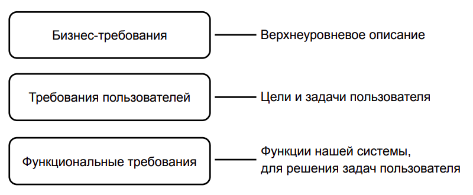
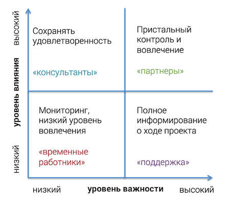
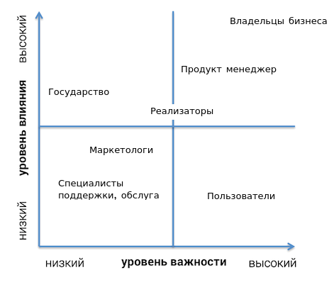
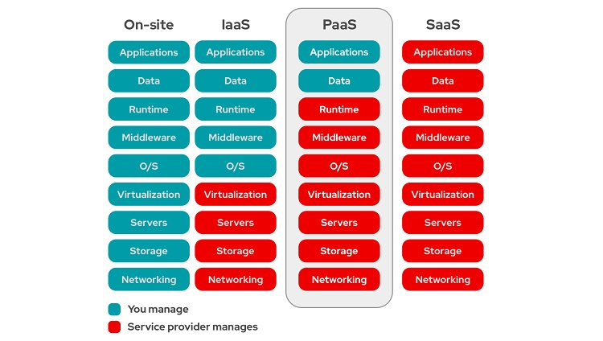
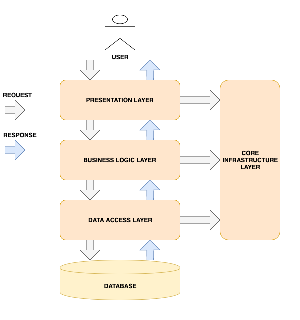

#                     Дипломный проект, часть 1.

###           Детализация и чёткое прописывание бизнес-целей.  

Вводная по тому на чем мы будем концентрироваться на протяжении всего проекта: само по себе слово приложение является абстрактным и часто под этим понятием принимается как структурный элемент в программировании, так и непосредственно клиентское приложение на устройстве клиента, ввиду того что мы будем по сути делать крутой фитнес трекер с магазинов наших товаров внутри - нам соверешенно точно стоит сконцетрироваться непосредственно на приложениях для носимой электроники. 

Бизнес цели я вижу следующие: 

1. Так как мы в первую очередь компания которая продает спортивные товары, а не занимается благотвортельностью, то основная и самая главная бинес цель: к концу первого года работы приносить не менее 10% совокупного объема продаж по отношению ко всем остальным бизнес единицам компании (сайт, специализированные приложения).
2. Нам крайне важно сделать по-настоящему хорошее приложение, которым будут пользовваться как уже существующие клиенты компании, так и потенциально новые. Ввиду этого стоит ввести следующую бизнес цель: процент удержания не меньше половины от числа скачавших пользователей.  Удержанным пользователем будет считаться тот который пользуется приложением хотя бы раз в каждый месяц на протяжении полу года после скачивания. 
3. Войти в топ-5 приложений такой же тематике в App Store и Google Play по окончанию первого года работы. 

###                Анализ и список функциональных требований.

Функциональные требования - это требования которым должна отвечать наша система чтоб потенциальный пользователь нашего продукта смог удовлетворять свои потребности. 

Исходя из диаграмы ниже можно сделать вывод что пропущен крайне важный этап выделения требований пользователя: 

Ввиду этого буду описывать функциональные требования через призму потребностей пользователей и даже некоторых стейкхолдеров. 

| As a/an                   | I want to                                                    | So that                                                      | Функциональное требование                                    |
| ------------------------- | ------------------------------------------------------------ | ------------------------------------------------------------ | ------------------------------------------------------------ |
| Пользователь              | Иметь возможность зареистрироваться                          | Получать персонализированную информацию.                     | Иметь возможность регистрации, хранения, логина пользователей в систему. |
| Пользователь              | Записывать свои тренировки. А после просматривать их.        | Я мог наблюдать их после их окончания, анализировать и делиться ими. | Организовать хранение и вывод трекинговой информации.        |
| Пользователь              | Получать персональные предложения, скидки, акции, бонусы.    | Мог делать покупки более приятно и адаптированно.            | Реализовать бонусную систему, систему подсказок товаров и предложений. |
| Пользователь              | Общаться с другими такими же клиентами.                      | Мог удовлетворять коммуникативные потребности не выходя из приложения. | Создать систему которая бы отвечала за хранение и передачу сообщений. |
| Пользователь              | Получать сообщения сразу по мере их прихода в фоновом режиме. | Мог получать сообщения проще и быстрее.                      | Реализовать систему push уведомлений.                        |
| Пользователь              | Делиться своими тренировками и публиковать в соц сетях.      | Мог повышать свое ЧСВ.                                       | Организовать систему шеринга информации: короткие ссылки, готовые сниппеты для инстаграмма и твиттера. |
| Пользователь              | Мог оставлять комментарии под тренировками других людей.     | Мог коммуницировать с другими участниками вне личных сообщений. | Сделать возможность оставлять комментарии под тренировками пользователей. |
| Пользователь              | Мог делать покупки внутри приложения.                        | Не надо было выходить из приложения и мог тратить деньги не тратя силы/время. | Встроит внутрь интернет магазин с каталогом товаров и рекомендаций. |
| Пользователь              | Мог отслеживать доставку                                     | Был спокоен и видел движение своего заказа.                  | Реализовать отображение состояния заказа, рендер движения заказа в режиме реального мера по карте. |
| Пользователь              | Мог платить внутри приложения                                | Была возможность платить картами, а не наличными курьеру.    | Подключить добавление и оплату картами, подклюить Apple Pay, Google Pay. |
| Пользователь              | Мог коммуницировать с тех поддержкой                         | Закрывать свои вопросы.                                      | Встроить возможность написать в тех поддержку.               |
| Пользователь              | Мог заполнить свой профиль, указать вид спорта, поставить аватар. | Персонифицировать свой профиль, удовлетворить творческие порывы. | Дать возможность сохранить основную информацию о пользователе, среди которой вид спорта и марка/модели обарудования. |
| Пользователь              | Подключать доп устройства: часы, браслеты.                   | Мог подключать свои уже существующие устройства и интегрировать/синхронизировать между собой. | Ознакомиться с API основных игроков рынка носимой электроники, сделать наше приложение совместимым. |
| Пользователь              | Мог сранивать свои успехи с другими участниками и своими более старыми тренировками. | Отслеживать свой прогресс/дегресс.                           | Сохранение и агрегация тренировок пользователей. Отображение их на карте с треком маршрута, если тренировки предполагают уличную активность с перемещением в пространстве: бег, вело и тд. Введение систем участков. |
| Пользователь              | Получать подсказки по тренировкам.                           | Мог прогрессировать а не деградировать.                      | Реализовать динамическую систему анализа данных тренировок пользователя, выдача релевантных рекомендаций. |
| Пользователь              | Читать доп литературу/информацию/статьи/исследования не выходя из приложения. | Мог обогощать свои знания о выбранном виде спорта.           | Создать систему по хранению и выводу постов.                 |
| Пользователь              | Получать доставку на дом.                                    | Мог не тратить время на получение товара и сделать шоппинг более приятным. | Интегрировать уже существующую в компании систему доставки.  |
| Пользователь              | Хочу видеть статистику по своим тренировкам в классном виде как в Apple Watch. | Мог наблюдать свой прогресс/дегресс.                         | Реализовать систему ачивок и удобоваримое отображение статистики. |
| Пользователь              | Хочу быть уверенным что мои персональные данные в безопасности | Мог без оглядки пользоваться сервисом                        | Большое внимание удалить безопасности данных                 |
| Пользователь              | Хочу мгновенно получать важные уведомления                   | Чтоб всегда быть в курсе всех событий                        | Сделать Messaging систему поддерживающую все основные интерфейсы (sms, email, push). |
|                           |                                                              |                                                              |                                                              |
| Маркетолог                | Хочу удобно влиять на важные для меня параметры: SEO.        | Мог управлять продвижением сайта и дополнять проект необходимыми мне данными. | Реализовать интеграцию с маркетинговыми средствами управления проектом. |
|                           |                                                              |                                                              |                                                              |
| Автор текстов             | Удобно сохранять и редактировать авторский контент.          | Мог работать более продуктивно.                              | Реализовать админку с поддержкоой удобного встроенного редактора постов, изображений. View/edit/create в рамках своей области. |
| Администратор             | Хочу иметь возможность влиять на публикуемый контент в нашем приложении. | Мог вычищать неприемлимый противречащий законодательству контент. | Сделать админку с гибкой системой прав. Администратор может не только view, но еще и edit. |
| Специалист тех поддержки. | Хочу общаться с пользователями не прибегая к помощи сторонних мессенджеров. | Реализовать поддержку онлайн чата между пользователями и специалистами тех поддержки. | Сделать онлайн чат для тех поддержки. Только view.           |
| Специалист тех поддержки. | Хочу просматривать информацию о пользователе и его заказах.  | Повысить эффективность своей работы и не спрашивать глупые вопросы (номер заказа и тд.). | Предусмотреть уровень прав для спецов из тех поддержки. Только view, ограниченные edit права. |
| Владелец бизнеса.         | Хочу все видеть и контролировать.                            | Быть в курсе всего происходящего.                            | Реализовать админку с широким уровнем view прав.             |

Итого можно выделить 3 основные направления которые будет пытаться релизовать наше приложение/сервис: 

1. Удобная и адаптивная площадка для покупок товаров собственного производства. 
2. Система трекинга и записи тренировок. 
3. Социальная составляющая: личные сообщения, профили юзеров, возможности комментирования, создания чат групп. 

Базовый сценарий использования будет следующим: зарегестрированный пользователь переодически заходит в наше приложение посмотреть на тренировки его соседей/друзей/знакомых, иногда оставляет комментарии, иногда записывает свои тренировки, попутно получая персоналные предложения адаптированные конкретно под него, совершает переодически покупки. Пользователь очень рад и советует наше приложение своим друзьям/знакомым. 

Помимо требованиий пользователя на функциональные требования влияют следующие крайне важные факторы:

1. Законодательные требования. На текущем этапе не выявлено никаких препятствий к реализации нашего сервиса/приложения, кроме как требование озвученные в ФЗ 152 "Закон о персональных данных". В соотвествии с которым мы обязаны хранить персональные данные пользователей на территории РФ. Так как исходя из условия текущего задания мы пользуемся облачными провайдерами, то велика вероятность что наша компания пользуется сервисами AWS/GCP. Текущий закон безусловно считается ограничением, но не критичным. Также важно отметить требования PCI DSS, в соотвествии с которыми мы не можем хранить информацию о банковских картах пользователей в наших системах баз данных. Мы можем это делать только получив соотвествующую (труднополучимую) лиценизю. 
2. Требования регулятора. Мы не финансовая/игорная/букмекерская организация и под требования регулятивных органов в превычном их понимании не попадаем. 
3. Физические ограничения. Так как мы размещаемся в облаке то любое ограниче это вопрос суммы чека за предоставляемый хостинг, это значит что любые ограничения подобного типа вытекают из бюджета на реализацию и поддержку. 
4. Финансовые ограничения. Неизвестно но будем полагать что их нет, ограничения вытекают исходя из здравого смысла. 
5. Прочие ограничения. Сюда бы я отнес ограничения специфичные для нашего контекста. Ввиду того что потенципльные потребители будут общаться с нашим сервисом с мобильных устройств, им свойственно иметь некоторые проблемы с передачей информации: низкая скорость интернета, особенно в регионах, обрывчатый характер связи. Усубляет положение то, что наши пользователи будут пользоваться приложением  "в полях": на пробежках, прогулках, покатушках, вдали от цивилизации. 

###                     Анализ стейкхолдеров и их интересов.

Стейкхолдер (stakeholder) — понятие, которое описывает человека, группу лиц или отдельные организации, чьи действия, поведение или решения могут влиять на проект и ход его релаизации. Стейкхолдеров разделяют на внутренних (находятся внутри организации) и внешних (за пределами предприятия). Диаграмма ниже представляет основную классификацию стейкхолдеров. 

Первая стратегия заключается в максимальном вовлечении и применяется к стейкхолдерам с высоким уровнем важности и влияния. Данная группа представляет собой основных стейкхолдеров проекта и должна максимально привлекаться у принятию решений в проекте. Необходимо повышать заинтересованность группы в проекте и полностью удовлетворять ее потребности. Рекомендуется использовать принцип партнерства в коммуникации при ведении переговоров по проекту с этой группой.

Вторая стратегия носит консультативный характер и применяется к стейкхолдерам с высоким уровнем влияния, но низким уровнем важности, второстепенным стейкхолдерам. Их рекомендуется привлекать в качестве консультантов и согласовывать с ними только важные стратегические решения по проекту.

Третья стратегия заключается в получении поддержки проекта и применяется к стейкхолдерам с низким уровнем влияния, но высоким уровнем важности, второстепенным стейкхолдерам. Данная группа стейкхолдеров должна быть ознакомлена со всеми ключевыми решениями по проекту, не смотря на то, что она не принимает прямого участия в решениях по проекту. При этом рекомендуется данную группу привлекать к обсуждению возможных проблем и заручаться поддержкой у нее дополнительной поддержкой по важным решениям.

Четвертая стратегия заключается в игнорировании и используется для стейкхолдеров с низким уровнем влияния и низким уровнем важности, второстепенных стейкхолдеров. Рекомендуется исключительно привлекать данную группу к выполнению требуемых задач, не погружать ее в детали проекта и использовать самый низкий уровень информирования.

В контекте нашей задачи во внешнюю группу стейкхолдеров я бы выделил:

1. Пользователи нашего приложения.
2. Государство в виде регулиррующего органа и различных законов.

Во внутреннюю группу: 

1. Владельцы бизнеса и их представители. Сюда же можно отнести миноритариев, инвесторов, бизнес партнеров, углубляться можно бесконечно. В рамках дипломного проекта по Архитектуре ПО нам важно выделить всех указанных в данном пункте стейкхолдеров просто как бизнес. 
2. Реализаторы проекта: программисты и прочие специалисты (devОps, designerers, QA). 
3. Продукт менежер или тот кто будет вести проект на этапе его разработки и поддержки. Его можно было бы отнести в группе реализаторов проекта, но его уровень важности и вовлеченности отличается.
4. Маркетологи или те кто будут продвигать проект.
5. Будущие низкоуровенвные технические работники проекта: контент менеджеры, работники поддержки, авторы текстов.

Всех вышеназванных стейкхолдеров я б разместил в диаграмме в следущем виде:

Конечно в первую очередь мы должны удовлетворять интересы бизнеса, это первоочередная задача. У бизнеса один главный интерес: получение прибыли. 

Связующим звеном между бизнесом и тем кто будет реализовывать проект является продукт менеджер или в рамках нашего контекста эту роль скорее всего будет выполнять архитектор проекта. Его интересы будут максимально быстро и качественно реализовать возложенные на него обязанности. 

Нельзя не считаться и с интересом самих разработчиков, их мнение и заинтересованность важны. Разработчики хотят четкое и понятное ТЗ, некоторую свободу в ходе выполнения задач и общую интересность поставленных задач.

Государство имеет достаточно высокий уровень влияния и накладывает ряд ограничений на реализацию проекта, например своими законами, штрафами, регулятивными огранами, уголовным кодексом. Но уровень важности (он же уровень заинтересованности) около нулевой.

Противиположностью государству  являются конечные пользователи, они никак не могут повлиять на ход проекта, лишь косвенно, но их уровень важность и/заинтересованности крайне высок.

Менее заинтересованными и важными явлются маркетологи, их не особо заботит успех проекта, это работники второго звена которые просто делают свою работу. 

Еще более менее заинтересованными сторонами можно назвать специалистов тех. поддержки, контент менеджеры и прочие низкоуровневые специлисты. Им вообще без разницы что там и как, дайте лишь возможность осуществлять прямо возложенную на них деятельность и все. 

###                  Разработка концептуальной архитектуры.

Существует два основныз типа архитектуры: 

1. Монолитная архитектура.
2. Распределенная архитектура.

Рассмотрим таблицу ниже:

Следует помнить одну очень важную вещь:

​     *Золотое правило микросервисной архитектуры - не делать микросервисную архитектуру.* 

Любая архитектура должна развиваться эволюционным путем, от простого к сложному. Но исходя из контекста текущей задачи, где среди прочего упоминается интернациональный характер деятельности предприятия вкупе с высокой нагруженностью, очевидно, что развивать монолитный вариант приложения заведомо плохая идея. Поэтому нам остается выбирать между типами распределенных архитектур. 

Некоторые архитектуры с их плюсами и минусами уже отображены в таблице выше:

1. Монолитная архитектура. Самый простой вариант, легок, понятен, дешев. Хорош при небольших размерах приложения. С ростом числа пользователей и RPS начинает не справляться с нагрузкой в геометрической прогрессии, не наш вариант. 
2. Распределенный монолит. Переходный вариант между монолитом и распределенной архитектуры, который сочетает оба подхода. Компромисный вариант, полумеры, не наша остановочка. 
3. Micro-Kernel. Тип расрпделенной архитектуры, в которой функционалость подключается как блоки. Например чудесный сайт под названием Skillbox.ru работает на этой арзитектуре. Хорош для приложений которые продают контент или доступ к нему. Тоже не наш вариант. 
4. Микросервисная архитекура. Сложно, долго, дорого. Но в долгосрочной перспективе максимально выйгрышный вариант. Наш выбор, наш кандидат.

В таблице выше не представлены сторонние подвиды микросервисной архитектуры: 

1. SOA (Service oriented). Первая попытка создания расрпделенной архитектуры. ESB сильно усложняли коммуникацию между сервисами. Признана сообществом как неудачная. 
2. SBA (Service Based). Неплохой вариант но по сути тоже самое что и распредленный монолит: переходная стадия от монолита к распредленной. У данного типа архитектуры есть одно очень существенное ограничение: он предолагает единую базу для всех сервисов. При росте числа пользоателей это может и будет бутылочным горлышком нашего приложения. Помимо этого существенные ограничения на параллельное развитие сервисов, вопросы миграций баз данных и синхронизация изменений в БД. 
3. SBA (Space Based). Чрезвычайно сложное и дорогое архитектуное решение. Реализация такого проекта может растянуться на долгие годы. Не наш вариант. 
4. Event Driven. Состоятельное архитектурное решение для всей системы, которое имеет как свои плюсы так и минусы, к минусам которого можно отнести достаточно высокую сложность такого решения, его поддержку, отладку, создание компенсационных механизмов. К Event Driven подходу можно прибегнуть в отдельных частях нашего будущего приложения: например в отдельных интеграциях между сервисами. 

Распределнная архитектура в лице микросервисов решает следующие проблемы: 

1. Доступность. Микросервисы могут быть реплицированы в любом колличестве в любой тайм зоне и автоматически. 
2. Автономность. Микросервисная архитектура подразумевает максимальную независимость одного сервиса от другого. 
3. Возможноть изменений и параллельного развития. Ввиду независимости каждый сервис можно развивать параллельно не мешает другим сервисам. 
4. Поддерживаемость. Также вытекает из автономности. Обычно за каким-то микросервисом закрепляется своя команда разработчиков, которые знают его как свои пять пальцев. 
5. Секьюрно. Можно настроить гибкий высокий уровень защиты и прав. 
6. Масштабируемость. Реплицируется до бесконечности. 

Но следует отметить и следующие минусы: 

1. Сетевые проблемы. Об этом подробнее ниже. 
2. Интерфейсы и интеграции. Чем больше микросервисов и интерфейосов через которые они общаются - тем больше интеграций, значит больше потенциальных точек отказов. Слабое место всех расрпделенных архитектур. 
3. Проблемы с балансировкой и обнаружением. Если микросервисы могут реплицироваться, то нужен тот кто будет делать эти реплики, регистрировать их в реестре и распределять нагрузку между ними. Дополнительное сложное звено системы и еще одна большая точка отказа. 

Про сетевые проблемы можно сказать следующее: 

1. Сеть  не надежна. Обрывы соединений, нестабильность - боль с которой придется жить. 
2. Даже самая быстрая сеть подразумевает задержки (latency), это дополнительное ограничение которое в будущем может встать боком. 
3. Пропускная способность ограничена, тем же самым гигабитом. Данная проблема решается за очень большие деньги и прокладкой своих кабилей в дата центр провайдера. 
4. Сеть небезопасна. В нее можно внедриться, воровать трафик, прослушивать. Влечет за собой дополнительные траты на обеспечение безопасности. 
5. Сеть неодонородна, в ней множество устройств которые должны общаться меж собой и которые ввиду своей неидеальной природы глючат/ломаются/перезагружаются. 

И тут казалось бы, одно лечим другое калечим, плюсы едва превышают минусы, но у нас есть таблетка от большинства минусов распредленных систем, а эта таблетка называется PAAS. 

PAAS провайдер, такой как Google или AWS практически полностью закроет наши проблемы с сетью, репликацией, балансировкой и обнаружением. Единственной проблемой которой нам все еще предстоит решать это сами микросервисы и интеграции между ними. 

Исходя из контекста задачи мы в любом случае должны были пользоваться облачными провайдерами (под предлгом того что уже существущие решения хостятся в облаке), но данное решение наших проблем вытекает само. 

Кроме того что у нас будет распредленная система, мы прибегнем еще к N-tier решению. 

У нас будет отдельный слой с презинтацией данных, здесь мы будем сериализовывать и десериализовывать данные. В бизнес слое будет происходить вся бизнес логика нашего приложения. Data access layer и DB layer будет отвечать за хранение и доступ к информации.  Данный подход является классическим в подобных решениях. 

Помимо этого некоторые API точки нашего приложения будут реализовывать CRUD принципы. 

Заранее можно сказать что одной из таких точек будет точка по редактированию состава корзины товаров. 

При проектировании низкоуровенвых решений (микросервисов и их частей) мы будем полагаться на закон Конвея, который звучит как: 

​           *«Организации проектируют системы, которые копируют структуру коммуникаций в этой 																					организации»*

А также будем полагаться на DDD подход, будут выделены доменные области, выработан общий язык, выделены агрегаты, сущности, объекты-значения. 

!!!!! Вставить изображение системы верхнеуровневое

рассказать кратко про основные блоки.

Основные блоки: 

1. Юзер: его профиль с маркаой инвентаря, ава. 
2. Его фид: новости, статьи, подписки, рекомендации, реклама товаров. 
3. Мессаджинг. 
4. Трекинговая система 
5. Доставка и склад внешние уже существующие системы. 

Типы активности: бег и велосипед. Остальные потом. 

###          Описание рисков реализации (бизнес и технические).

в конце 4,2 видео.

плюс Так как микросервисы, то: 

###        План поэтапной разработки и расширения системы, анализ    критически важных компонентов.  

написать про мвп, базу с которой выйдем на рынок. 

###                   Выделение критических бизнес-сценариев.

###                                        Атрибуты качества.

Каждая архитектура должна быть в первую очередь нацелена на достижения бизнес целей. Вместе с этим архитектура должна учитывать огранчения и содержать в себе выделенные атбрибуты качества. 

Тем не менее это еще не все, также важной частью требований к архитектуре являются и атрибуты качества. 

**Глобальные** **атрибуты качества:** 

​	QA-1: Interoperability. Мы должны встроить нашу систему в уже имеющуюся систему компании, где реализованы и интернет магазины и остальные доменные области. 

​	QA-2: Elasticity. Система должна выдерживать всплески нагрузки а также сезонный трафик. 

​	QA-3: Reliability. Система должна быть доступна 24/7 из большинства стран мира. Простой допустим в окна с минимальным трафиком на профилактические работы. 

**Атрибуты качества** **для модуля** **User/Api Gataway**:

​	QA-: Security. Так как мы работаем с персональными данными пользователем критическими являются требования к безопасности данных. Все передачи информации должны быть зашифрованы, доступ к данным строго ограничен. 

**Атрибуты качества** **для модуля** **Content**:

​	QA-: Security. Нейронные сети будут работать с персональными данными, требования схожи с аналогичными для User/Api Gataway модулем.

​	QA-: Modifiability. Разработка нейронных сетей или использование уже готовых носит динамический характер. Система должна легко поддаваться изменения и переезжать с одной рекомендательной модели на другую. 

**Атрибуты качества для модуля Tracking:**

​    QA-: Perfomance. Менее строгие требования чем к модулю Messaging, но тем не менее данный модуль будет хранить большое колличество данных. 

**Атрибуты качества для модуля Shop:**

​	QA-: Aviability. Продавать товары и получать с этого прибыль наша главная задача. Встроенный магазин  и система оплаты должны быть доступны всегда. 

**Атрибуты качества для модуля Messaging:**

​	QA-: Perfomance. Система должна переваривать десятки/сотни сообщений в секунды. Добиться можно только построив систему на очередях сообщений. 

Выделить основные, например наблюдаемость. первое видео 4 урока с середины. 

###               Анализ и список нефункциональных требований.

###   Анализ и описание архитектурных опций и обоснование выбора.  

идеи: 

1. кеширование. использование приложения в полях. 
2. оценка и стоимость в 4,2
3. риски тоже в 4,2 в конце 
7. боты в тех поддержку
8. транснациональный хостинг. 
9. влепить ДДД
10. об АДР в 17,1
11. в 17,2 схемки которые я должен показать при презентации архитектуры. 
12. локальный расчет параметров тренировки, отображении на карте с кеширование и послеующим выгрузкой на бек. 
13. описать что у нас большинство баз микроверсивов в облаке а основная с пользовательской информацией у нас в локелке. обхединение сетие 