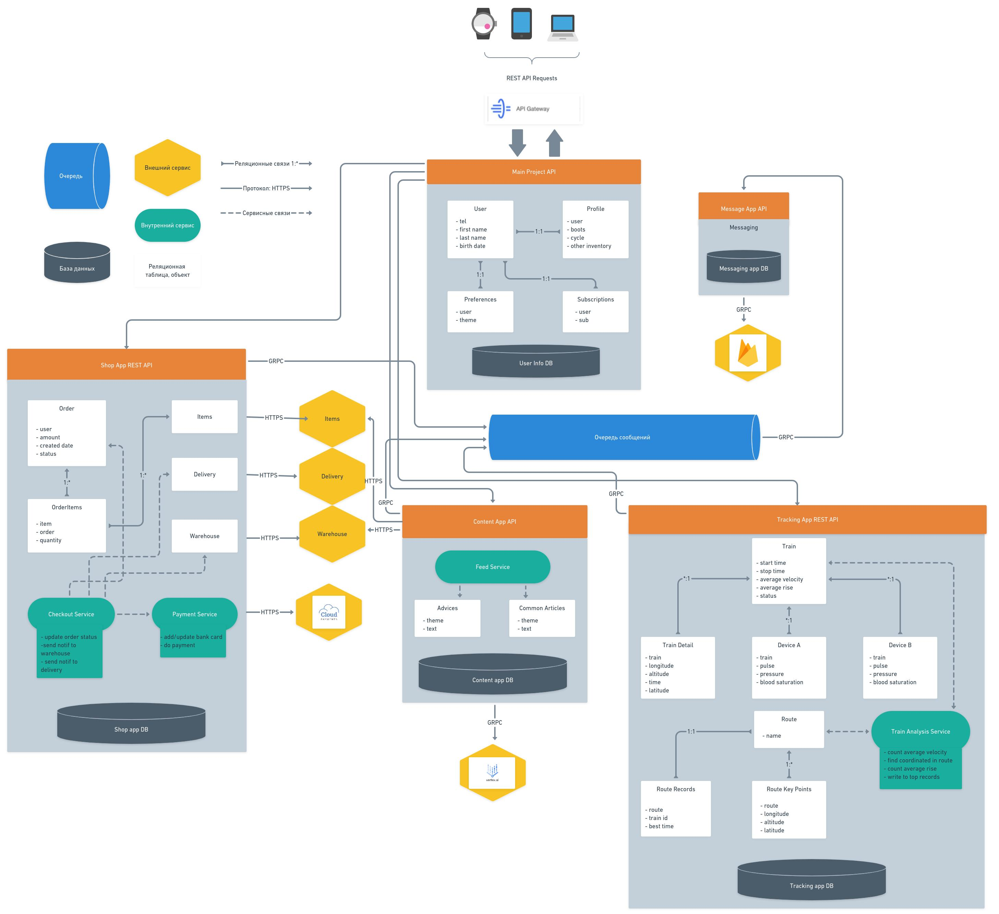

## 																			Дипломный проект, часть 2.

**Список ADR.**  

ADR (architecture decision record) - документ, который фиксирует важные архитектурные решения, а также контекст и следствия этого решения. 

На текущий момент мы имеем следущие ADR: 

* [ADR-1. ADR Style.](ADR/ADR-1.Style.md) 
* [ADR-2. Cloud provider.](ADR/ADR-2.Cloud_provider.md)
* [ADR-3. Database.](ADR/ADR-3.Database.md)
* [ADR-4. API Gateway.](ADR/ADR-4.API_Gateway.md)
* [ADR-5. Messaging system.](ADR/ADR-5.Messaging_system.md)
* [ADR-6. Payment Provider.](ADR/ADR-6.Payment_Provider.md) 
* [ADR-7. Neural Engine.](ADR/ADR-7.Neural_Engine.md) 

**Описание сценариев использования приложения.**  

Классические сценарии использования приложения преведены ниже. Желтым выделины внешние к нам системы, графитовым внутренние, зеленым блоки принятия решений. 

Схема совершения покупок авторизованным юзером внутри нашего приложения:

Схема сохранения тренировки:

Схема получения инливидуального контента: 

**Базовая архитектура с учётом ограничений бизнес-требований, НФТ, выбранной архитектуры, адресация атрибутов качества.**

Финальный вид архитектуры: 

Как уже было упомянуто выше, представленная здесь схема реализует микросервисную архитектуру, где основные микросервисы общаются между собой по REST интерфейсам, за исключением Message микросервиса. 

Также стоит отметить следующее: 

Любое архитектурное решение развивается итеративно. Архитектурное решение представленное в этом параграфе является лишь концептом и конечное архитектурное решение может сильно отличаться от изначального. По ходу реализации архитектуры могут начать появляться новые вопросы/проблемы, которые придется решать и будет хорошо если проблемы начнут появляться сразу, а не под самый конец. Последнее грозит полной перестройкой всех моделей и всей архитектуры со всеми вытекающими последствями.  

**Основные представления:**  

1. ​		**Функциональное.**  	

   Если мы исходим из того что функциональное представление документирует функциональную структуру системы, включая ключевые функциональные элементы, их обязанности, интерфейсы, которые они предоставляют, и взаимодействия между ними, то за получением такого представления можно обратиться к параграфу выше, где представлена базовая архитектура с учетом бизнес требований. 

2. ​		**Многозадачность (concurrency).** 

   Ввиду того что мы исходим из предположения что весь функционал интернет магазина уже реализован в нашей компании (исходя из условий задания), то проблем с concurrency (а именно решение проблемы с race condition и тд) лежат полносью в плоскости того кто предоставляет нам API для работы с его системой. Мы работаем по правилам этого API и осуществляем требуемые от нас интеграции. 

   Что касается наших приложений, то проблем с параллелизмом не предполагается. При росте нагрузки провайдер увеличит количество инстансов нашего приложения для уменьшения latency клиентских запросов. Большое количество одновременных работающих веб приложений не помешают друг другу, так как приложения не должны хранить какие-либо состояния. Все состояния хранятся в базе и все приложения имеют доступ до базы. 

3. ​		**Инфраструктурное.** 

   На этой схеме не найти load balancers, health checkers, различных кластеров. Все потому что мы будем размещать свои приложения в App Engine. Данная технология по хостингу приложений берет все инфраструктурные проблемы на себя. Чтобы разместить новую версию нашего приложения от нас требуется только лишь одна коротенькая команда в терминале, все остальное за нас сделает Google. При росте нагрузки инастансы нашего приложения будут реплицированы автоматически.

   Всю инфраструктуру можно представить в виде сетей, где GCP Net - сеть PAAS провайдера, в которой крутятся наши приложения и внутрненние сервисы самого провайдера, которыми мы тоже будем пользоваться. 

   Common Net -  общая сеть, которая объединяет в себе сеть Google как PAAS провайдера плюс внутренняя сеть нашего предприятия, в которой уже реализованы такие домены как Delivery, Warehouse, Items. Во внутренней сети на наших собственных мощностях также будут находиться те базы данных присуствие которых требуется на территории РФ законодательством РФ. Различные служебные базы данных, которые требуются для функционирования наших приложений, для большей надежности можно держать в сети Google на мощностях Google со все такой же автоматической репликацией, схожей в таковой в App Engine. 

   Во внешней сети WWW будут находиться внешние к нам сервисы, например сервисы платежного провайдера.

4. ​		**Информационное.** 

   Данное представление имеет смысл в случае Event Sourcing архитектуры. Но так как наша архитектура построенна на классической микросервисной схеме с REST интерфейсами, то все информационные потоки сводятся к REST API архитектуре: 

    

   Все микросервисы общаются друг с другом через REST, исключение составляет только микросервис Messaging, работа которого завязана на Google Pub/Sub.

   Pub/Sub работает следующим образом: 

   

   Если какой-то микросервис хочет послать сообщение пользователю - все что от него требуется отправить тело сообщения с мета информацией с специализированный канал, где это сообщение будут обработано и доставлено получателю: микросервису Messaging. Это позволяет сделать систему более гибкой и надежной: существует гарантия доставки и обработки сообщения. 

5. ​		**Безопасность.**  	

   Основным инструментом для обеспечения безопасности будет система аутентификации/авторизации на основе JWT: 

JWT работает следующим образом:

1. Сперва пользователь заходит на сервер аутентификации с помощью аутентификационного ключа (это может быть пара *логин/пароль*, либо *Facebook* ключ, либо *Google* ключ, либо ключ от другой учетки).
2. Затем сервер аутентификации создает *JWT* и отправляет его пользователю.
3. Когда пользователь делает запрос к API приложения, он добавляет к нему полученный ранее *JWT*.
4. Когда пользователь делает API запрос, приложение может проверить по переданному с запросом *JWT* является ли пользователь тем, за кого себя выдает. В этой схеме сервер приложения сконфигурирован так, что сможет проверить, является ли входящий *JWT* именно тем, что был создан сервером аутентификации.

Кроме того следует также уделить внимание системе троттлинга, дабы защитить нашу систему от хотя бы примитивных  DDOS атак. Данную защиту можно выстроить как на нашем авторизующем модуле, так и на стороне API Gateway от самого гугла. В таком случае входящие соединения в наше приложения будут выглядеть следующим образом: 

 

Также, хотя это и по умолчанию понятно, все соединения в наше приложения будут только по протоколу HTTPS с автоматическим редиректом с HTTP:

Таким образом мы защищаемся от целого ряда атак, которые основаны на внедрении и прислушивании сети. Злоумышленник получит зашифрованные данные, которые он не сможем расшифровать без сертефикатов которые установлены на стороне сервера. 