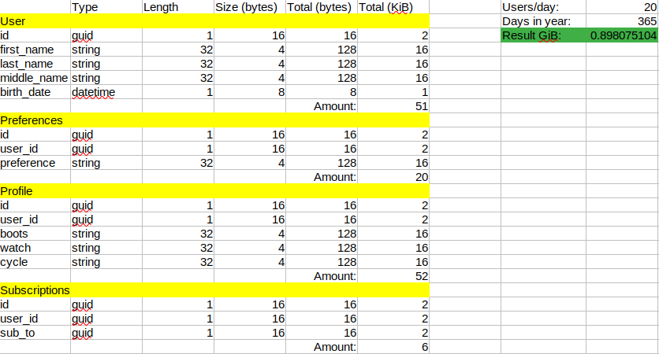
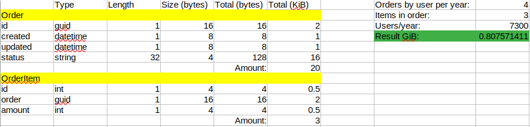
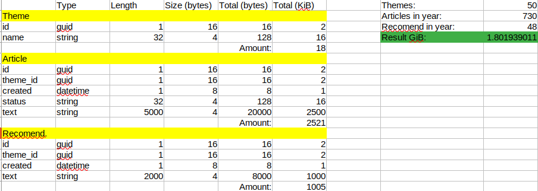
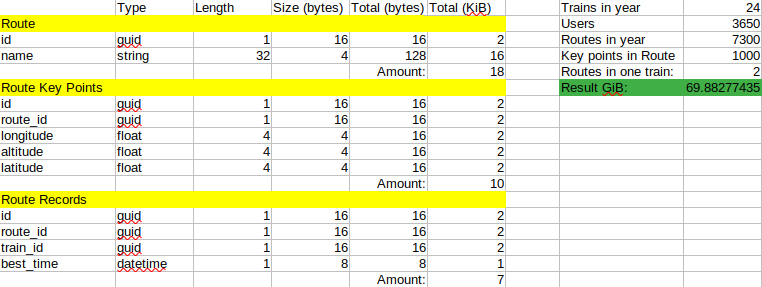
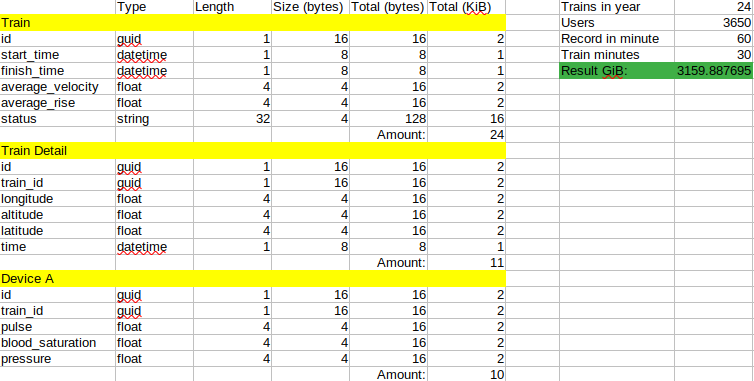
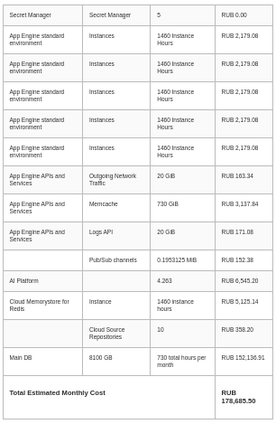
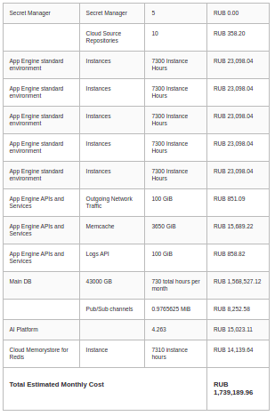

**Стоимость владения системой в первый, второй и пятый годы с учётом роста данных и базы пользователей.** 	

Будем считать что наша система разрабатывалась при помощи следующих специалистов с такими заробатными платами (вопрос налогообложения и отчислений опущен):

* 1 Product manager (250k).
* 1 Senior backend developer (250k).
* 1 Middle backend developer (150k).
* 1 Juniour backend developer (80k).
* 1 Senior frontend developer (250k).
* 1 Middle frontend developer (150k).
* 1 Juniour frontend developer (80k).
* 1 UI-designer (120k).
* 2 Data-science and ML developer (180k). 
* 2 Middle QA (120k).

Будем считать что разработка ведется пол года (оптимистический срок), год (сбалансированный срок), два года (пессимистический срок). Исходим из того что был реализован средний сценарий и разработка проекта завершилась за год.

Итого за разработку было потрачено 4.570 млн руб в год. 

Считается что поддержание системы стоит треть от стоимости разработки, тогда поддержание в системы в каждый из годов будет стоить 1.3 млн руб в год.  

Сперва посчитаем то сколько данных будет хранить наше приложение, это нужно для того чтоб грамотно подобрать конфигурации для базы данных и не переплачивать за более дорогие и мощные instance. 

Ввиду того что точно спрогнозировать (даже в рамках учебного проекта) поток потенциальных клиентов и то как они будут пользоваться приложением нереально, то для хоть каких-либо расчетов будем опираться на некие предположения. 

Предположения для первого года работы для домена Authentification/API Getaway: 

* Количество регистрирующихся юзеров в день: 20.
* Каждый юзер имеет в среднем 1 preference.
* Каждый юзер подписан хотя бы на одного другого пользователя. 

Тогда в первый год работы нам понадобится 0.9 GiB пространства в год. 

Предположения для первого года работы для домена Shop:

* Так как 20 юзеров в день, то тогда 7200 юзеров в год.
* Каждый юзер делает 1 order раз в сезон, итого 4 раза в год. 
* В каждом order находится хотя бы 3 OrderItems (товара). 

Тогда в первый год работы нам понадобится 0.8 GiB пространства в год. 

Предположения для первого года работы для домена Content: 

* Каждый день пишется 2 новых статьи. 
* Каждую неделю пишется одна новая рекомендация. 
* Существует 50 различных тем. 

Тогда в первый год работы нам понадобится 1.8 GiB пространства в год. 

Предположения для первого года работы домена Tracking:

* Средний юзер тренируется хотя бы 2 раза в месяц.
* Тренируются половина от числа всех пользователей. 
* Координаты записываются раз в секунду. 
* В среднем тренировка длится 30 минут.
* У каждого юзера есть хотя бы один носимый девайс (часы, пульсометр и тд), которые тоже записывают данные о тренировке. 
* Каждый юзер создает 2 маршрута в год. 
* Каждый юзер при тренировке в среднем пересекает 2 маршрута пользователей системы.
* Каждый маршрут состоит из 1000 ключевых точек.  

Модуль Route домена Tracking будет потреблять 69 GiB в год:

Модуль Train домена Tracking будет потреблять 3200 GiB в год:  

Итог для первого года работы: 3233 GiB пространства или 3.2 TiB. 

Предположим что для второго года работы справдливы все допущения выше, но также предположим оптимистический полуторократный рост пользователей с 20 до 30 новых пользователей в день. В таком случае нам понадобится хранилище чтоб умещать данные за первый год работы (3.2 TiB) плюс пространство для информации, которая сгенеируется во втором году в размере 4.9 TiB (расчеты аналогичны тем же что и в первом году, поэтому в подробном виде приводиться не будут). Выходит, что во втором году у нас должен быть DB сервер баз данных, который вместит 8.1 TiB данных. 

Чтобы расчитать стоимость владения системой на пятом году ее жизни, также предположим полуторократный рост пользователей в год вплоть до пятого. Тогда за третий год будет сгенерировано 7.3 TiB данных, за четвертый 11 TiB. И тогда в пятом будет сгенерировано 16.3 TiB  данных при 100 новых пользователей в день. Также стоит учитывать данные накопленные за прошлые годы работы. 

Рассчитаем стоимость, если мы пользуемся Google Cloud Platform как PaaS провайдеров нашей системы с учетом уровня нагрузки расчитанного выше. Также будем увеличивать среднее колличество рабочих инстансов App Engine от года к году.

Воспользовавшись калькулятором, предоставляемого самим Google мы получаем следующие расценки для первого года работы:   

Выходит, что стоимость услуг провайдера будет стоить 0.844 млн руб в год, плюс 1.3 млн руб на поддержание системы командой разработчиков или 2.14 млн в первый год работы (не разработки).

Во второй год работы будут следующие расценки на услуги провайдера: 

Выходит, что стоимость услуг провайдера будет стоить 2.136 млн руб в год, плюс 1.3 млн руб на поддержание системы командой разработчиков или 3.436 млн во второй год работы.

В пятый год работы системы стоимость будет следующая: 

Выходит, что стоимость услуг провайдера будет стоить 20.868 млн руб в год, плюс 1.3 млн руб на поддержание системы командой разработчиков или 22.168 млн в пятый год работы.

Прочие общие но важные допущения: 

* Важно что все расчеты предполагают ступенчатый рост по началу нового года, а не экспоненциальный. 

* При расчете количества данных сгенированных приложением Tracking существует допущение, что в каждом отдельном году трафик генируруют только новые пользователи. Таким образом реализовываеттся допущение некого естесственного оттока пользователей.

* При расчете стоимости PaaS услуг от года к году кратно увеличвается количество одновременно работающих instance, размеров кеша, объемов исходящего трафика.  
* Все основные данные мы храним в Cloud SQL.

Вывод по стоимостным оценкам: траты на PaaS  систему от года к году начинают расти в геометрической прогресии, тогда как стоимость поддержания системы командой разработчиков можно приравнять к некой константе, если мы не учитываем рост зарплат и инфляцию. Большую часть денег потребляет хранение данных. 

**Анализ рисков созданной архитектуры, компромиссов.**

Для данного пункта справедливо все то что написано в артефакте "Описание рисков реализации (бизнес и технические)" из [первой части](part1-10.md) данной работы.

Любое архитектурное решение связано с теми или иными компромисами. В большей степени справедливы риски характерные для данного типа (микросеривисной) архитектуры:

* Сложность разработки. Которая кратно увеличивает и время разработки тоже. 
* Сложность трейсинга. Поддержка такого рода систем тоже будет дороже чем у более простых аналогов.
* Сетевые риски. Передача данных даже в рамках одной сети влчет за собой сложности и риски. 
* Интеграции. Больше интеграций - больше точек отказа. 

Конечно же мы получаем следующее: 

* Большую стабильность. 
* Большую доступность. 
* Большую масштабируемость. 
* Меньшую связанность. 

Помимо этого следует отметить также следующие крупные риски: 

* Риски повышения порога рентабельности от года к году. Прибыль от продажи товаров внутри нашего приложения должна покрывать издержи от поддержания системы. Если в первые годы работы издержки работы системы еще не такие большие, то уже к пятому году они растут как снежный ком и  отбивать подобные затраты уже становится сложнее. Вероятность того что наше приложение станет нерентабельным растет с течением времени. 
* Риски того что достук к PaaS системе будет ограничен. Например блокировка YouTube/Google. 
* Валютные риски. 

Стоимость PaaS услуг можно кратно снизить путем уменьшения интервалов записи тренировок, так если тренировка будет записываться раз в 2 секунды, а не в 1, то объем хранение информации (грубо) уменьшается вдвое. Но это является компромисным решением, поскольку будет страдать точность и актуальность данных собираемая нашим приложением со всеми вытекающими последствиями. 
